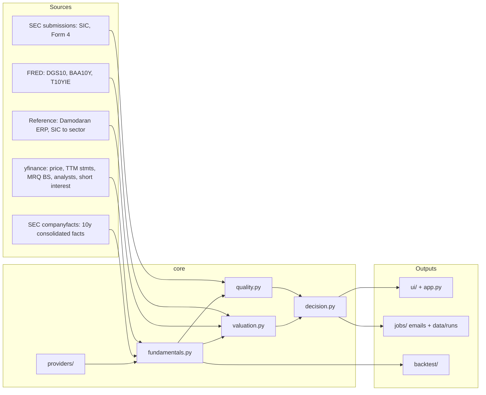

# Architecture

Live scoring and the backtest share one fundamentals path: SEC companyfacts
(consolidated, filing-date point-in-time, TTM flows + MRQ balance sheet) with
Yahoo as fallback. The Streamlit app is a thin shell over `ui/`.

## Module responsibilities

| Module | Responsibility |
|--------|----------------|
| `core/edgar_facts.py` | Companyfacts parse, TTM, annual series, PIT as-of |
| `core/fundamentals.py` | Unified 10y annual + TTM `Fundamentals` object, Yahoo fallback, goodwill/OE inputs |
| `core/data.py` | Yahoo fetch, FX for `.TO`, cache, fund raw metrics |
| `core/data_quality.py` | Yahoo vs EDGAR reconciliation, grade A/B/C |
| `core/rates.py` | FRED DGS10 / BAA10Y / T10YIE, hurdle = max(floor, rf+ERP) |
| `core/valuation.py` | Owner earnings, DCF base/bear, EPV, reverse DCF, expected return, relative |
| `core/quality.py` | Five-bucket quality score, value-trap flags |
| `core/decision.py` | Accumulate / Watch / Avoid, buy-below, gates |
| `core/scoring.py` | Cross-section percentiles, legacy composite, `is_good_buy` |
| `core/providers/` | `FundamentalsProvider` protocol: edgar, yahoo, optional finnhub, sharadar stub |
| `core/universe.py` | S&P 500/400 + TSX 60 snapshot (`universe`, `currency`, `country`) |
| `core/fund_universe.py` | Fund snapshot (unchanged model) |
| `ui/` | CSS/layout, charts, stock/fund views, rankings, sidebar, Streamlit cache |
| `app.py` | `st.set_page_config` + `main()` only |
| `jobs/` | Weekly watchlist, monthly universe, Damodaran refresh, SMTP, run summaries |
| `backtest/` | PIT panel, metric registry, stats (NW t, block bootstrap), report |

## Rules of the road

- Fund path (`score_fund`, `build_fund_raw_metrics`) stays working; signature
  changes to `score_universe_df` must remain backward compatible.
- `ui/` views import formatting/charts; charts/formatting never import views.
- No `st.*` work at import in `ui/` except lazy `st.cache_data` wrappers in
  `ui/state.py`.
- Run `streamlit run app.py` from the **repo root** (no `sys.path` hack).
- Backtest stays S&P 500. Live `universe.members` may add `sp400` and `tsx60`.
